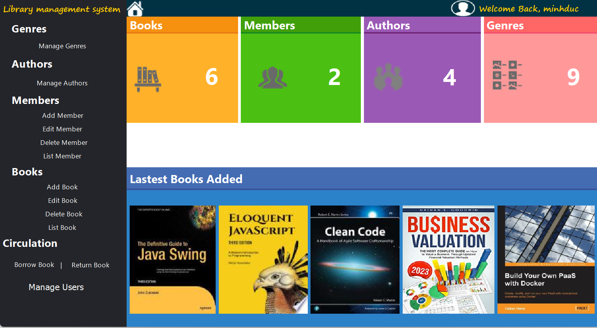
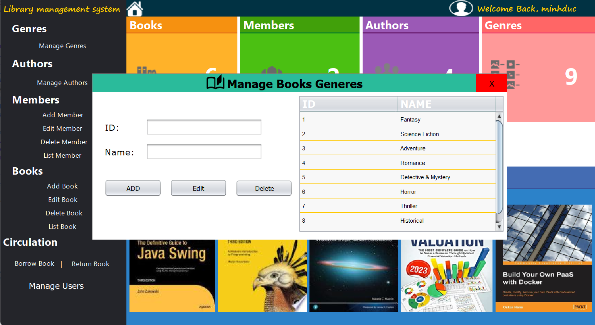
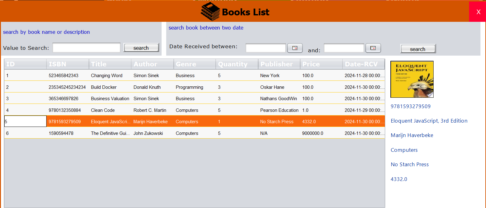
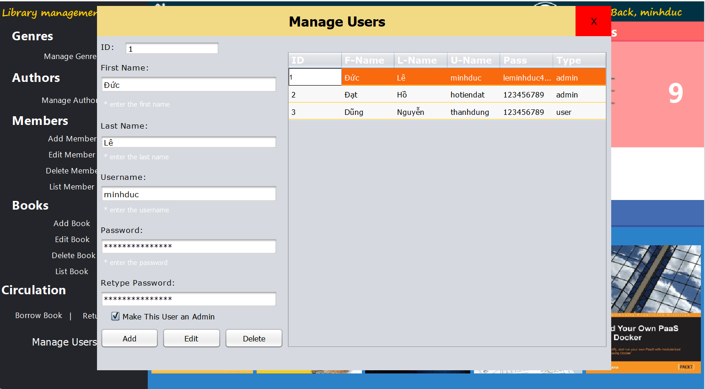

 # ***Java Library Management*** 

## **Introduction**

Nhóm thực hiện bài tập lớn gồm 2 thành viên:

| **Họ và tên**        | **Mã sinh viên** | **Lớp**   |  
|-----------------------|------------------|-----------|  
| **Lê Minh Đức**       | 23021532         | K68CS2    |  
| **Hồ Tiến Đạt**       | 22027158         | K67AE     |  

### **Thông tin bài tập lớn**
- **Tên bài tập lớn:** Phát triển ứng dụng Java quản lý thư viện  
- **Môn học:** INT2204 9 - Lập trình hướng đối tượng  

# Phụ lục
- [Description](#description)
  * [Library description](#library-description)
  * [Preview](#preview)
- [Setup](#setup)
- [See also](#see-also)
  * [Các kỹ thuật sử dụng](#các-kỹ-thuật-sử-dụng)
  * [Các nguồn tham khảo](#các-nguồn-tham-khảo)
- [Source Code Ứng Dụng](#source-code-ứng-dụng)
- [A Special Thanks To](#a-special-thanks-to)

## **Description** 
### *Library description* 
- Đây là ứng dụng được phát triển với nhiều tính năng hay, tiện ích, được lập trình với thư viện Swing.
- Ứng dụng có nhiều tính năng như:
  + Quản lý tài liệu (Thêm, Xóa, Sửa, Tìm kiếm).
  + Quản lý người dùng thư viện (mượn/trả tài liệu, thông tin thành viên).
  + Xử lý các trường hợp lỗi, như kiểm tra điều kiện khi mượn tài liệu.
  + Tích hợp API tra cứu thông tin tài liệu.
  + Chức năng tạo mã QR sau khi mượn tài liệu.
- Ứng dụng chắc chắn sẽ không khiến cho người dùng thấy thất vọng với những tính năng hữu ích và giao diện thân thiện với người dùng.

### *Preview*

## **Setup**
- Yêu cầu: có JDK.
    1. Tạo một New Folder bất kỳ, dùng terminal: git clone https://github.com/LeMinhDuc47/Library_Management_System.git
    2. Vào bất cứ IDE nào bạn có mở Folder ra và vào Login để bắt đầu dùng.
- *Mọi khó khăn trong phần cài đặt, trong quá trình dùng, vui lòng liên hệ qua 23021532@vnu.edu.vn. hoặc 22027158@vnu.edu.vn.*

## **See also**  
### *Các kỹ thuật sử dụng*  
- Thư viện Swing
- Sử dụng đúng các nguyên tắc OOP
- Xác định các lớp chính và triển khai kế thừa giữa các lớp
- Sử dụng Design Pattern vào ứng dụng
- Thiết kế database, kết nối database và sử dụng truy xuất dữ liệu cùng với tạo dữ liệu
### *Các nguồn tham khảo*
- Cách sử dụng, cài đặt Swing tham khảo từ cuốn sách: **An Introduction to Graphical User Interfaces with Java Swing**.  
  + [Link tham khảo tại đây](https://library.uniq.edu.iq/storage/books/file/GlobAl_EdiTioN_Software_Engineering_TENT/1666079371GlobAl_EdiTioN_Software_Engineering_TENT.pdf)
- Hình ảnh: các nguồn trên google, pinterest,..
    + [Google Fonts Icons](https://fonts.google.com/icons)
## **Source Code Ứng Dụng**
- Folder *file_jar*: Chứa toàn bộ file cần thiết để triển khai ứng dụng Java trên nền tảng.
- Folder *Mysql*: Chứa dữ liệu của các đối tượng trong thư viện.
- Folder *src*: Chứa toàn bộ code chính của ứng dụng.
- Folder *demo*: chứa ảnh demo về ứng dụng 
# **A Special Thanks To**
- **TS. Vũ Thị Hồng Nhạn** - Người hướng dẫn, Giảng viên.
- **CN. Trương Xuân Hiếu** - Người hướng dẫn, Giảng viên.